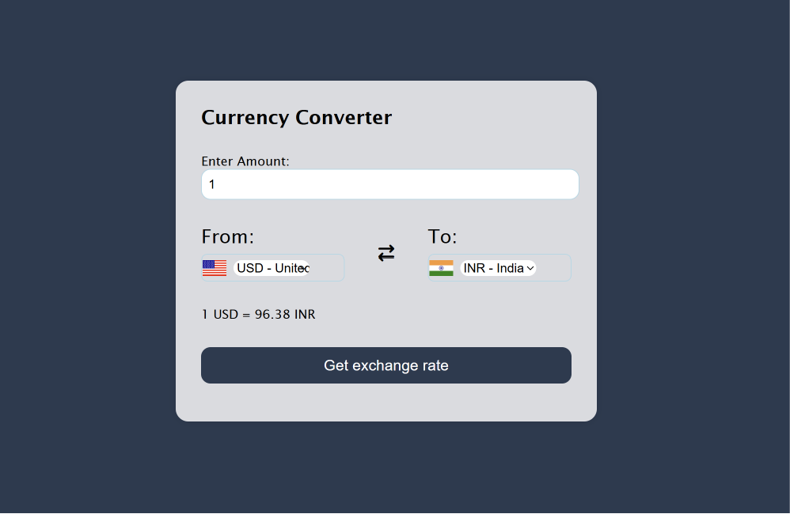

# Currency Converter

A browser-based currency converter built with HTML, CSS, and JavaScript that fetches live exchange rates.

## 📸 Preview

<!-- Add a screenshot of your app to the repo and update the filename above -->

## 💱 How It Works

Select a source currency and a target currency, enter an amount, and get the converted value using real, up-to-date exchange rates fetched from a live API.

## 🛠️ Built With

- **HTML5** — structure and input form
- **CSS3** — styling and layout
- **JavaScript** — fetching live data, conversion logic, DOM updates
- **Exchange Rate API** — for real-time currency rates
<!-- Replace with the actual API name you used, e.g. ExchangeRate-API, Frankfurter, etc. -->

## ✨ Features

- Convert between multiple currencies
- Real-time exchange rates (not hardcoded values)
- Simple input-based interface
- Instant result display
<!-- Update this list to match what your version actually does -->

## 📂 Project Structure

```
Currency-Converter/
├── index.html
├── style.css
└── script.js
```
<!-- Update to match your actual file names/folders -->

## 🚀 Getting Started

```bash
git clone https://github.com/nawaz76158-maker/Currency-Converter.git
cd Currency-Converter
```

Open `index.html` in your browser — no installation or build steps needed.

> Note: Since this project fetches live data, you need an active internet connection for conversions to work.

## 📌 What I Learned

- Making API calls using `fetch()` and handling asynchronous data
- Parsing JSON responses and updating the DOM dynamically
- Handling user input and validating it before sending a request
- Working with real-world, changing data instead of static values

## 🔗 More Projects

Check out my other work: [github.com/mdnawaz-dev](https://github.com/mdnawaz-dev)

---
*Built as part of my JavaScript practice.*
